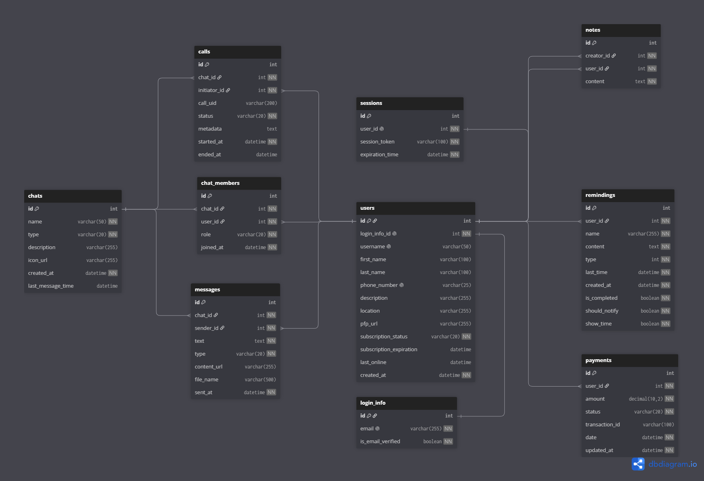

# Server Database

This document describes the database structure and database-related behavior of the Edemly server application.

The goal of this document is to explain how the server uses Entity Framework Core, how global and company-specific data are separated, how the main entities are related, and how database migrations are organized.

## Contents

* [Overview](#overview)
* [Database Provider](#database-provider)
* [Database Contexts](#database-contexts)
* [Entity Relationship Overview](#entity-relationship-overview)
* [Entity Notes](#entity-notes)
* [Indexes and Constraints](#indexes-and-constraints)
* [Enum Storage](#enum-storage)
* [Tenant Database Resolution](#tenant-database-resolution)
* [Tenant Provisioning](#tenant-provisioning)
* [Migrations](#migrations)
* [Testing Database](#testing-database)
* [Current Limitations](#current-limitations)
* [Related Documents](#related-documents)

## Overview

Edemly Server uses Entity Framework Core for database access.

The application uses a main server database and supports company-specific tenant databases. The main database stores global application data and company metadata. Company databases are used for tenant-specific workspace data.

The database model is implemented through two EF Core contexts:

| Context          | Purpose                                     |
| ---------------- | ------------------------------------------- |
| ServerDbContext  | Main application database                   |
| CompanyDbContext | Selected company database for tenant access |

The project uses a practical tenant-aware model. Application services can resolve which database context should be used depending on the current request and tenant state.

## Database Provider

The production database provider is MySQL.

The server uses the Pomelo Entity Framework Core provider for MySQL:

```
<PackageReference Include="Pomelo.EntityFrameworkCore.MySql" Version="9.0.0" />
```

The main connection string is configured through:

```
"ConnectionStrings": {
  "DefaultConnection": "..."
}
```

Production credentials and secrets should not be committed to the repository. They should be provided through environment variables, user secrets, deployment platform secrets, or CI/CD secret storage.

## Database Contexts

The server contains two database contexts and two design-time factories:

```
Data/
├─ ServerDbContext.cs
├─ CompanyDbContext.cs
├─ ServerDbContextFactory.cs
└─ CompanyDbContextFactory.cs
```

ServerDbContextFactory and CompanyDbContextFactory are used by Entity Framework tools when creating or applying migrations.

Both contexts share most of the same entity model:

```
Users
LoginInfos
Sessions
Chats
ChatMembers
Messages
Notes
Remindings
Payments
Calls
Emails
```

The main difference is that ServerDbContext also contains:

```
Companies
```

Companies is stored only in the main database because it contains company workspace metadata and tenant database information.

| Context          | Contains Companies | Main purpose                                    |
| ---------------- | ------------------ | ----------------------------------------------- |
| ServerDbContext  | Yes                | Global data and company metadata                |
| CompanyDbContext | No                 | Tenant-specific data for selected company scope |

The current CompanyDbContext shares most of its entity model with ServerDbContext. This keeps the implementation simple, but it also means that global and tenant-specific models are not yet strongly separated at the entity level.

## Entity Relationship Overview

The following diagram shows the main logical relationships between the core database entities.



The diagram focuses on the main user, authentication, chat, message, note, reminder, payment, and call relationships.

It does not show every technical table or every column. Supporting entities such as Company and Email are described separately because they are not part of the main chat/user relationship graph.

## Entity Notes

The main database model contains the following core entities:

| Entity     | Purpose                                                 |
| ---------- | ------------------------------------------------------- |
| User       | User profile and account-related data                   |
| LoginInfo  | Authentication credentials and email verification state |
| Session    | User session information                                |
| Chat       | Private or group chat                                   |
| ChatMember | User membership in a chat                               |
| Message    | Text, file, voice, or other chat message content        |
| Note       | User-created note about another user                    |
| Reminding  | Reminder/task data                                      |
| Payment    | Payment and subscription-related data                   |
| Call       | Call-related data                                       |
| Company    | Company workspace metadata                              |
| Email      | Email addresses used by company-related functionality   |

Most relationships are shown in the diagram above. The main special cases are:

* LoginInfo and User have a one-to-one relationship.
* User and Session have a one-to-zero-or-one relationship.
* Note has two relationships to User: creator and target user.
* Call is connected to both Chat and the initiating User.
* Company is not part of the main entity graph. It stores tenant metadata such as company name and physical database name.
* Email is a supporting entity for company-related functionality.

Notes have two separate relationships to User:

```
Note.CreatorId -> User.Id
Note.UserId    -> User.Id
```

Both note relationships use restricted delete behavior to avoid ambiguous cascade deletes.

Most other relationships use cascade delete behavior. This means that deleting a parent record can delete dependent records such as chat members, messages, payments, reminders, sessions, or calls.

## Indexes and Constraints

The database model defines several indexes and uniqueness constraints.

| Entity    | Constraint            |
| --------- | --------------------- |
| LoginInfo | Email is unique       |
| User      | Username is unique    |
| User      | LoginInfoId is unique |
| User      | PhoneNumber is unique |
| Session   | UserId is unique      |
| Company   | Name is unique        |

These constraints prevent duplicate accounts, duplicate user identities, duplicate active session records per user, and duplicate company workspace names.

## Enum Storage

Several enum properties are stored as strings in the database.

The following properties use string conversion:

| Entity     | Property           |
| ---------- | ------------------ |
| User       | SubscriptionStatus |
| Chat       | Type               |
| ChatMember | Role               |
| Message    | Type               |
| Payment    | Status             |
| Call       | Status             |

Enum values are limited to a maximum length of 20 characters where configured.

String-based enum storage makes database values easier to read, but enum renaming should be handled carefully because renamed enum values can affect existing data.

## Tenant Database Resolution

Tenant-aware database access is handled through dedicated tenancy infrastructure.

Relevant components:

| Component                  | Responsibility                                              |
| -------------------------- | ----------------------------------------------------------- |
| TenantResolutionMiddleware | Resolves tenant information from the incoming request       |
| ITenantProvider            | Provides access to the current tenant state                 |
| TenantProvider             | Stores current tenant information during request processing |
| DbContextResolver          | Selects ServerDbContext or CompanyDbContext                 |
| TenantDbContextFactory     | Creates CompanyDbContext instances for selected companies   |

The general flow is:

1. A request enters the server.
2. TenantResolutionMiddleware checks whether the request contains tenant information.
3. If a matching company is found, the current tenant context is set.
4. Application services can use DbContextResolver.
5. Global operations use ServerDbContext.
6. Tenant-specific operations use the selected CompanyDbContext.

The important rule is that one request should resolve to one active database context model:

* global operation → ServerDbContext
* tenant operation → selected CompanyDbContext

A request should not operate on all company databases at once.

## Tenant Provisioning

Company database provisioning is handled by TenantProvisioningService.

When a new company is created, the service:

1. Normalizes the company name.
2. Checks whether a company with the same name already exists.
3. Creates a company record in the main server database.
4. Builds a tenant database name.
5. Creates the physical MySQL database if it does not exist.
6. Applies CompanyDbContext migrations to the new tenant database.
7. Returns the created company metadata.

Tenant database names currently follow this pattern:

```
edemly_company_{company_name}
```

Company names are normalized by trimming, converting to lowercase, and replacing spaces with underscores.

Example:

```
Example Company -> example_company
```

Resulting tenant database name:

```
edemly_company_example_company
```

## Migrations

The project contains separate migration folders for the main database and company databases:

```
Data/Migrations/
├─ ServerDb/
└─ CompanyDb/
```

The current migration structure is:

```
Data/Migrations/ServerDb/
├─ 20260603154841_InitialCreate.cs
├─ 20260603154841_InitialCreate.Designer.cs
└─ ServerDbContextModelSnapshot.cs

Data/Migrations/CompanyDb/
├─ 20260603154859_InitialCreate.cs
├─ 20260603154859_InitialCreate.Designer.cs
└─ CompanyDbContextModelSnapshot.cs
```

Because the server uses two DbContexts, migrations should be created with an explicit context.

Example command for the main database:

```
dotnet ef migrations add MigrationName \
  --context ServerDbContext \
  --output-dir Data/Migrations/ServerDb
```

Example command for company databases:

```
dotnet ef migrations add MigrationName \
  --context CompanyDbContext \
  --output-dir Data/Migrations/CompanyDb
```

Database updates should also specify the context:

```
dotnet ef database update --context ServerDbContext
```

```
dotnet ef database update --context CompanyDbContext
```

For tenant databases, migrations are applied programmatically during tenant provisioning.

## Testing Database

Server integration tests use a dedicated test setup.

The test project uses SQLite in-memory database infrastructure to avoid depending on a real MySQL server during tests.

This allows integration tests to run in isolation and makes database-related tests faster and more predictable.

Detailed testing setup is described in [TESTING.md](TESTING.md).

## Current Limitations

The current database design is suitable for the current project size, but several areas should be reviewed later:

* ServerDbContext and CompanyDbContext currently share most of the same entities. This is simple, but it can become harder to maintain if global and tenant-specific data start to diverge significantly.
* Tenant-related abstractions may need clearer separation if multi-tenancy becomes more complex.
* Company database lifecycle rules should be clarified for backup, deletion, renaming, tenant migration rollout, and failed provisioning rollback.
* Uploaded files, generated runtime data, connection strings, database credentials, payment secrets, JWT keys, and email provider secrets should not be committed to the repository.

## Related Documents

* [Server Architecture](ARCHITECTURE.md)
* [API](API.md)
* [Authentication](AUTH.md)
* [Deployment](DEPLOYMENT.md)
* [File Storage](FILE_STORAGE.md)
* [Realtime](REALTIME.md)
* [Testing](TESTING.md)
